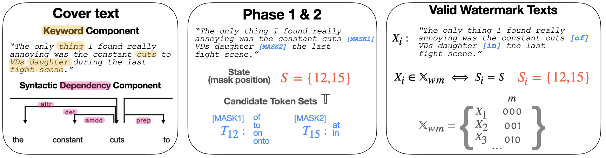

# Robust Multi-bit Natural Language Watermarking through Invariant Features (ACL 2023)
Our work proposes a natural language watermarking framework that is robust against various types of corruption by 
exploring invariant features of natural language. 



It also includes our implementation of an earlier work **ContextLS** 
(*Yang, Xi, et al. "Tracing text provenance via context-aware lexical substitution." 
Proceedings of the AAAI Conference on Artificial Intelligence. Vol. 36. No. 10. 2022.*).

## Repository Overview
Some directories and files to note: 
- [./models/](models) contains all the modules used in our watermarking framework such as 
keyword extracting, dependency parser, mask selection, corruption, etc.
- [./utils/](utils) contains utility modules for preprocessing the dataset, mask infilling, 
logging, computing metrics, and ContextLS as well. 
- [./scripts/](scripts) contains shell scripts for running experiments.
- [./ours.py](ours.py) is main script for embedding and extracting watermarks. 
- [./context-ls.py](context-ls.py) is the script for embedding and extracting for ContextLS.


## Getting Started 
After installing `torch` and `transformers`, setup the environment by 
`bash setup.sh` in the container. <br>


## Watermarking Your Content
Instead of running it on a public dataset, you can try watermarking your own text.
To do this, go to `./demo.py` and change the following variables:
`
raw_text, custom_keywords
`.
You can try out the different configurations (e.g. components, keyword ratios, etc)
or run it with the default setting by `python ./demo.py`.

## Reproducing Results
### Watermarking
Shell scripts for watermarking (embed and extract) under corruption and without corruption 
are in `./src/example/`.<br />
Change the appropriate parameters to replicate the other results. 
Below we explain some important variables related to our framework in the shell script: <br>
```
SPACYM: type of spacy model used for dependency parsing
KR: keyword ratio that determines the number of keywords and masks (see Table 11 for configuration)
TOPK: topk infill words used to infill selected masks (see Table 11 for configuration)
MASK_S: mask selection method, choose from {keyword_connected, grammar}
MASK_ORDR_BY: ordering of masks by {dep, pos}. This is only relevant when using dependency component
EXCLUDE_CC: exlucde the cc dependency as detailed in Section 5.2
K_MASK: how mask is selected when using keyword component; only relvant when using keyword component, choose from {adjacent, child} 

# Below are other variables
CKPT: checkpoint to the finetuned robust infill model 
```
### Training Robust Infill Model 
Run `./src/train_infill.sh`. Most of the variables are reused. Changing $DATA_TYPE to the desired datasets
and $KR to the corresponding value will train the infill model used in the main experiments.
Some specific variables for training the infill model are:
```
EPOCH: number of epochs to train (fixed to 100 for our experiments)
KL_TYPE: type of kl, choose from {forward, reverse}
MASKING_TYPE: method to mask tokens (Sec. 3.3), choose from {ours, random}
MASKING_P: masking proportion (fixed to 0.15 for our experiments), this is only relevant when MASKING_TYPE=random
OPTIM_TOPK: whether to optimize only the topk predicted tokens (fixed to true) 
```

Example checkpoint to the model finetuned on IMDB [here](https://drive.google.com/file/d/1Tibqqm5QnkDAM6mPqcqKiqfN1K3k5fpE/view?usp=share_link).
To use this checkpoint, provide the path to the file to `$CKPT`.


## Citation 
```
@misc{yoo2023robust,
      title={Robust Multi-bit Natural Language Watermarking through Invariant Features}, 
      author={KiYoon Yoo and Wonhyuk Ahn and Jiho Jang and Nojun Kwak},
      year={2023},
      eprint={2305.01904},
      archivePrefix={arXiv},
      primaryClass={cs.CL}
}
```
